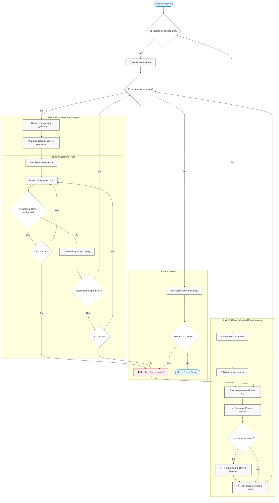
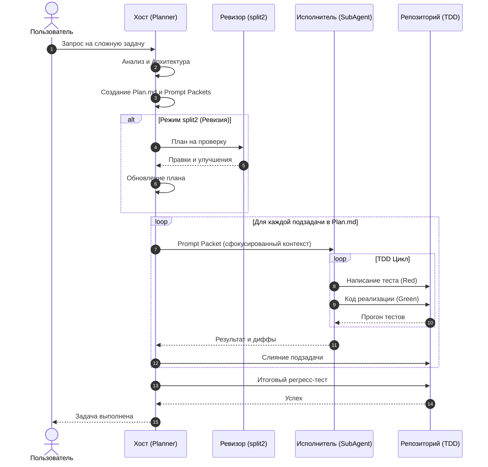
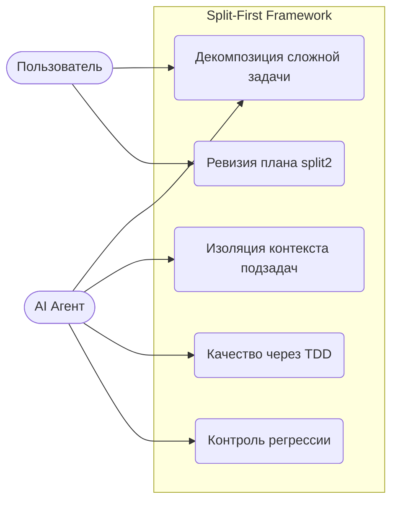

<!--
Name: split-first-orchestration-diagrams
Description: Сборник диаграмм (Workflow, Sequence, Use Case) для фреймворка split-first TDD оркестрации.
-->

# 📊 Диаграммы фреймворка

В этом файле собраны визуальные схемы, описывающие логику работы, взаимодействия и сценарии использования фреймворка.

---

## 🏗 Workflow (Процесс работы)

Эта диаграмма описывает жизненный цикл задачи от поступления до финального слияния (Merge).

---

## 🔄 Sequence Diagram (Линейный процесс взаимодействия)

Диаграмма последовательности показывает взаимодействие между Хостом (Планировщиком), Ревизором и Исполнителями.

---

## 🎯 Use Case Diagram (Сценарии использования)

Диаграмма описывает, какие задачи решает фреймворк для пользователя и агентов.

