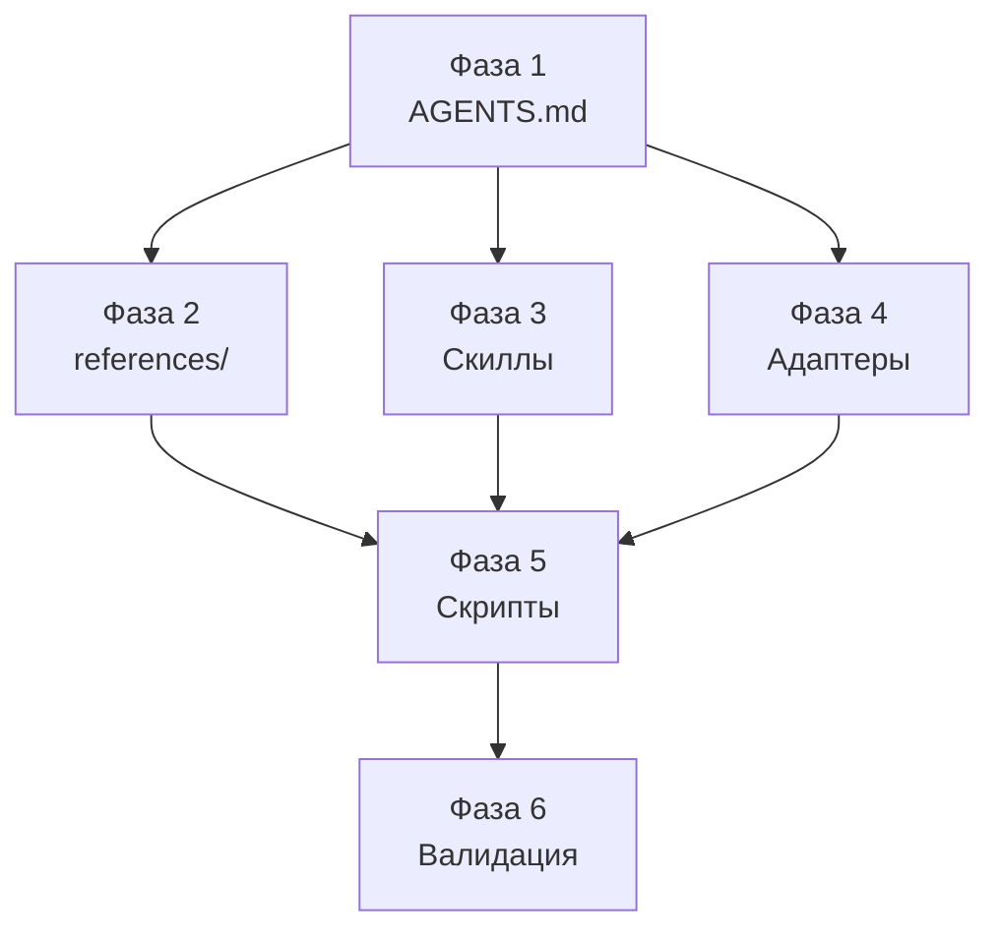

<!--
Name: Improvement Plan — Split-First Framework
Description: Атомарные задачи по доработке проекта split-first-tdd-agent-orchestration-framework. Предполагается, что проект соответствует текущему описанию в README.
-->

# 📋 План доработки проекта

## Исходный запрос

Аудит README выявил пробелы между описанием в README и содержимым файлов проекта. Нужно привести все файлы проекта в соответствие с обновлённым README: добавить контракт обработки ошибок, формат plan-файла, явную передачу файлов, приоритизацию, роль человека, контекстный бюджет и границы применимости.

## Переформулированная цель

Обновить все файлы проекта так, чтобы:
1. `AGENTS.md` (источник истины) содержал все новые контракты из README.
2. Файлы `references/` содержали шаблоны, соответствующие новым требованиям.
3. Адаптеры (`GEMINI.md`, `CLAUDE.md`) ссылались на новые контракты.
4. Скиллы декомпозиции включали дерево решений и правила приоритизации.
5. Скрипты установки инъектировали обновлённый контент.

---

## Фаза 1 — Канонический контракт (AGENTS.md)

### Задача 1.1: Добавить контракт обработки ошибок и перепланирования
- **Файл:** `AGENTS.md`
- **Что сделать:** Добавить секцию «Error handling contract» с правилами из README (§ «Обработка ошибок и перепланирование»): действия при провале подзадачи, при обнаружении нового факта, при stop condition, при полном отказе плана.
- **Тест:** Секция содержит 4 сценария отказа с явным описанием действия планировщика.

### Задача 1.2: Добавить контракт контекстного бюджета
- **Файл:** `AGENTS.md`
- **Что сделать:** Добавить секцию «Context budget contract»: свежий контекст для подагента, планировщик контролирует объём prompt packet, передача состояния через файлы.
- **Тест:** Секция содержит 3 правила с явными формулировками.

### Задача 1.3: Добавить правила приоритизации исполнения
- **Файл:** `AGENTS.md`
- **Что сделать:** В «Dispatch contract» добавить правила порядка: read-first, write-after-read, sequential-on-overlap, parallel-on-separation, граф зависимостей в plan-файле.
- **Тест:** Пять правил приоритизации присутствуют в dispatch contract.

### Задача 1.4: Добавить спецификацию plan-файла
- **Файл:** `AGENTS.md`
- **Что сделать:** Добавить секцию «Plan file contract»: формат plan-файла (исходный запрос, переформулированный запрос, архитектура, перечень подзадач с атрибутами и ссылками на файлы-описания).
- **Тест:** Секция перечисляет все обязательные поля plan-файла.

### Задача 1.5: Добавить контракт роли человека
- **Файл:** `AGENTS.md`
- **Что сделать:** Добавить секцию «Human-in-the-loop contract»: человек может остановить конвейер, дождаться завершения, принять/отклонить результат. Обязательного gate-approval нет.
- **Тест:** Секция описывает 3 возможных действия человека и явно отрицает обязательное одобрение.

### Задача 1.6: Добавить требование явной передачи файлов подагенту
- **Файл:** `AGENTS.md`
- **Что сделать:** В «Prompt contract» добавить правило: планировщик обязан явно передать подагенту список файлов для чтения. Подагент не должен «угадывать» контекст.
- **Тест:** Правило присутствует в prompt contract.

---

## Фаза 2 — Справочные файлы (references/)

### Задача 2.1: Обновить матрицу маршрутизации
- **Файл:** `references/orchestration-matrix.md`
- **Что сделать:** В строке Gemini добавить «/ Antigravity». Добавить примечание: Antigravity = IDE Gemini, Claude Code — будет добавлен позже.
- **Тест:** Таблица содержит «Gemini / Antigravity» и примечание о Claude Code.

### Задача 2.2: Обновить шаблон prompt packet
- **Файл:** `references/subtask-prompt-template.md`
- **Что сделать:** Убедиться, что шаблон содержит все 10 обязательных полей из README (objective, context, scope, non-goals, files, dependencies, tests, acceptance_criteria, output_format, stop_conditions). Добавить явное указание: поле `files` включает список файлов для чтения.
- **Тест:** Каждое из 10 полей присутствует в шаблоне. Поле `files` содержит инструкцию о явной передаче.

### Задача 2.3: Создать шаблон plan-файла
- **Файл:** `references/plan-file-template.md` (новый)
- **Что сделать:** Создать шаблон с секциями: исходный запрос, переформулированный запрос (детализированные цели), архитектурные решения, перечень подзадач (таблица: название, тип, владелец, зависимости, ссылка на файл-описание).
- **Тест:** Файл существует и содержит все секции из спецификации plan-файла в AGENTS.md.

### Задача 2.4: Обновить шаблон ревизии плана
- **Файл:** `references/plan-review-template.md`
- **Что сделать:** Добавить проверки на: наличие error handling сценариев в плане, контекстный бюджет (prompt packet помещается в окно), порядок исполнения (read-first), graph зависимостей.
- **Тест:** Шаблон содержит 4 новые проверки.

---

## Фаза 3 — Скилл декомпозиции

### Задача 3.1: Добавить дерево решений split/не-split
- **Файл:** `agents/skills/task-splitting/SKILL.md`
- **Что сделать:** Добавить секцию «Decision tree» с критериями дробления и примерами из README (§ «Когда дробить, а когда нет»).
- **Тест:** Секция содержит 3 критерия дробления, 3 критерия «не дробить» и 3 примера с решениями.

### Задача 3.2: Добавить правила приоритизации в скилл
- **Файл:** `agents/skills/task-splitting/SKILL.md`
- **Что сделать:** Добавить секцию «Execution order» с правилами из README (§ «Порядок исполнения и зависимости»).
- **Тест:** Секция содержит 5 правил порядка.

---

## Фаза 4 — Адаптеры

### Задача 4.1: Обновить GEMINI.md
- **Файл:** `GEMINI.md`
- **Что сделать:** Добавить ссылки на новые контракты: error handling, context budget, plan file. Добавить команду для ре-планирования (например, ссылку на re-plan секцию AGENTS.md).
- **Тест:** GEMINI.md содержит ссылки на error handling contract, context budget, plan file contract.

### Задача 4.2: Обновить CLAUDE.md
- **Файл:** `CLAUDE.md`
- **Что сделать:** Аналогично GEMINI.md — добавить ссылки на новые контракты. Добавить примечание: Claude Code будет поддержан позже, адаптер пока минимален.
- **Тест:** CLAUDE.md содержит ссылки на новые контракты и placeholder-примечание.

---

## Фаза 5 — Скрипты установки

### Задача 5.1: Обновить install.ps1
- **Файл:** `install.ps1`
- **Что сделать:** Убедиться, что инъектируемый контент в AGENTS.md включает новые секции (error handling, context budget, plan file, human-in-the-loop, приоритизация, явная передача файлов). Обновить payload.
- **Тест:** После запуска `install.ps1` в чистом проекте, AGENTS.md содержит все новые секции внутри маркеров.

### Задача 5.2: Обновить install.sh
- **Файл:** `install.sh`
- **Что сделать:** То же, что 5.1, для bash-версии.
- **Тест:** После запуска `install.sh` в чистом проекте, AGENTS.md содержит все новые секции.

### Задача 5.3: Проверить uninstall-скрипты
- **Файлы:** `uninstall.ps1`, `uninstall.sh`
- **Что сделать:** Убедиться, что uninstall корректно удаляет расширенный блок между маркерами. Если маркеры не изменились — скрипты работают без изменений.
- **Тест:** После uninstall, маркированный блок полностью удалён.

---

## Фаза 6 — Валидация

### Задача 6.1: End-to-end проверка install → uninstall
- **Что сделать:** В чистой директории выполнить install.ps1, проверить все файлы (AGENTS.md, GEMINI.md, CLAUDE.md), затем uninstall.ps1, проверить что блоки удалены.
- **Тест:** Все файлы после install содержат маркированные блоки с новым контентом. После uninstall маркированные блоки удалены.

### Задача 6.2: Проверка согласованности README ↔ AGENTS.md
- **Что сделать:** Сверить все контракты, описанные в README, с реальным содержимым AGENTS.md. Каждый раздел README должен иметь соответствующий контракт в AGENTS.md.
- **Тест:** Все секции README (8 контрактных разделов) имеют соответствие в AGENTS.md.

---

## Граф зависимостей

## Итого

| Фаза | Задач | Зависит от |
|---|---|---|
| 1. AGENTS.md | 6 | — |
| 2. references/ | 4 | Фаза 1 |
| 3. Скиллы | 2 | Фаза 1 |
| 4. Адаптеры | 2 | Фаза 1 |
| 5. Скрипты | 3 | Фазы 2, 3, 4 |
| 6. Валидация | 2 | Фаза 5 |
| **Всего** | **19** | |
