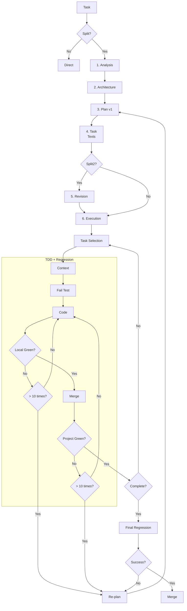

<!--
Name: split-first-tdd-agent-orchestration-framework-english
Description: Canonical problem statement, principles, split and split2 modes, plan file, error handling, and acceptance criteria for split-first orchestration in Codex, Gemini CLI, and Antigravity.
-->

# 🧩 Split-First TDD Agent Orchestration Framework

[](https://opensource.org/licenses/MIT)
[](#)
[](#)

[🇷🇺 Русская версия](README.md)

---

This repository defines the canonical rules for the **split-first** workflow: how to decompose large tasks, dispatch subtasks to subagents, perform pre-flight plan reviews, and verify results before merging.

### 🌟 Overview

This is a coordination layer, not a product feature. The rule set helps the agent:
- assess whether a large task needs decomposition
- turn a task into independent subtask cards
- dispatch cards to the appropriate subagent or CLI entry point
- generate a comprehensive prompt packet for each subtask
- use TDD for subtasks involving code changes
- verify the final diff before merging

### 📉 The Problem

Large coding tasks break when a single agent tries to do everything in one pass. This is especially evident with:
- small limits of expensive models
- cluttered context during sequential execution

Typical failures: context dilution, shallow reasoning, incorrect assumptions about repo state, accidental parallel editing, lack of tests, duplicated work due to lack of behavioral decomposition.

### 🎯 Goals

The main goal: increase agent productivity within the allotted limit through orchestration-level prompt engineering, cognitive load reduction, and detailed planning.

Specific sub-goals:
- **Reduce error count** on large code tasks — each subtask receives focused context instead of full repository chaos.
- **Increase reasoning depth** — decomposition turns one complex task into a set of simple ones, each solvable within a single TDD cycle.
- **Separate read and write** — read-heavy subtasks (investigation, bug reproduction) are isolated from write-heavy ones (code changes), eliminating context conflicts.
- **Make TDD the default mode** for implementation subtasks.
- **Keep the canonical policy in one place** and add pre-dispatch plan review.

### 🧭 When to Split and When Not To

**Split when:**
- the task spans multiple independent modules or behaviors
- subtasks can be validated with separate tests
- read and write operations can be separated into different contexts

**Don't split when:**
- everything fits in a single file and a single function
- the main unknown is architectural, not operational (decide first, then execute)
- the task is too small for orchestration overhead

**Examples:**

| Task | Decision | Why |
|---|---|---|
| "Add a `status` field to API endpoint" | Don't split | One file, one behavior, one test |
| "Refactor 5 modules + new test suite" | `/split` | Independent modules → parallel subtasks |
| "New microservice with unclear architecture" | `/split2` | Plan review first, then execution |

### 💡 Principles

- Decompose by behavior, not by file count.
- Prefer a single owner for each subtask.
- Do not parallelize overlapping writes.
- Use read-heavy subtasks for investigation and error reproduction.
- Use write-heavy subtasks only with separate responsibility.
- TDD for all implementation tasks (red-green-refactor).
- **Growing Regression**: each task complements the test suite. Project must always stay "green".
- Facts over memory; verify from narrow to broad.

### 🕹 Modes

- **`/split`**: Direct dispatch. Process: Analysis -> Architecture -> Plan v1 -> Task Texts -> Execution.
- **`/split2`**: Revision. Plan and texts are improved by another model before launch.

**Cross-platform review principle:** models from the same platform share common blind spots (training data biases, stylistic habits). Review by a different platform's model catches errors that "your own" reviewer would miss.

#### Orchestration Matrix

| Host | `/split` executor | `/split2` reviewer | `/split2` executor |
| --- | --- | --- | --- |
| Codex | Gemini 3 Flash | Gemini 3.1 Pro high | Gemini 3 Flash |
| Gemini / Antigravity | Codex GPT-5.4-mini super high | Codex GPT-5.4 xHigh | Codex GPT-5.4-mini super high |

> [!NOTE]
> Antigravity is a Gemini-based IDE agent and shares the same matrix row. A Claude Code row will be added later.

#### Workflow Diagram



### 📦 Prompt Packet Format

Each subtask dispatched to a subagent must contain a full prompt packet:

| Field | Description |
|---|---|
| **objective** | What exactly needs to be done |
| **context** | Business context and architectural decisions |
| **scope** | Files and modules included in the subtask |
| **non-goals** | What is explicitly out of scope |
| **files** | List of files to read and modify |
| **dependencies** | Dependencies on other subtasks |
| **tests** | Which tests to write / which must pass |
| **acceptance_criteria** | Subtask acceptance criteria |
| **output_format** | Expected output format |
| **stop_conditions** | When to stop and request help |

> [!IMPORTANT]
> The planner **must** explicitly pass to the subagent: specific instructions + list of files to read. The subagent must not "guess" the context on its own.

Full template: `references/subtask-prompt-template.md`.

### 🔄 Execution Order and Dependencies

1. **Planning**: Analyze the request and choose architecture before the task list.
2. **Detailing**: The plan consists of detailed texts (Prompt Packets) for each task.
3. **Cycle**: Sequential launch of sub-agents.
4. **TDD + Regression**: Sub-agent loop: Fail -> Code -> Green. Then merge into the regression suite and achieve **all** tests passing before finishing.
5. **Growing Result**: Each cycle confirms project integrity.
6. **Dependency Graph**: Described in the plan file; the dispatcher follows this graph.

### 🧠 Context Budget

Decomposition solves the context problem as follows:

- **Each subagent gets a fresh context.** It does not inherit the planner's "cluttered" context — only the prompt packet with target files.
- **The planner controls volume.** The prompt packet must fit within the subagent's working window. If it doesn't — the subtask is too large and needs further splitting.
- **State transfer.** Intermediate results between subtasks are passed through files in the repository (commits, artifacts), not through agent context.

### 🔁 Error Handling and Re-planning

The framework is not limited to the happy path. Rules for failures:

- **Subtask failed (tests don't pass):** the verifier records the failure. The planner decides: retry with a refined prompt or re-split the task.
- **One subtask's context affects another:** a read-heavy subtask discovered a fact that changes the plan → the planner updates the plan file and recreates affected cards before dispatch.
- **Subtask needs clarification:** the subagent triggers a stop condition → the planner receives the request and refines the prompt.
- **The entire plan was wrong:** the verifier after final review can initiate a full re-plan.

### 👤 Human Role

The framework does not require mandatory approval at each step but ensures **full transparency**:

#### Plan File

Created for every split/split2 and contains:
- **Original user request** — verbatim.
- **Reformulated request** — detailed goal, explicit sub-goals.
- **Architectural decisions** — key decisions made before dispatch.
- **Subtask list** — name, attributes (type, owner, dependencies), link to the subtask description file for the subagent.

#### Subtask Files

Each subtask is described in a separate file with a full prompt packet, available for inspection.

#### Control

- The human can **stop the pipeline** at any point.
- The human can **wait for completion** and analyze how the pipeline performed.
- The human can **accept or reject** the final changes.

> [!NOTE]
> There is no mandatory gate-approval. The goal is not to block the agent but to give the human the ability to observe and intervene when needed.

### 📐 Scope and Limitations

**The framework is suitable for:**
- Code tasks where tests can be written
- Multi-agent environments (Codex CLI, Gemini CLI, Antigravity)
- Projects with test infrastructure or the ability to create one

**The framework is NOT suitable for:**
- One-line edits that don't require decomposition
- Tasks where TDD is impossible (pure infrastructure without tests, one-off scripts)
- Projects without CLI access to agents

**Prerequisites:**
- A test framework (or willingness to create one)
- CLI access to at least one agent for subtask dispatch
- A file system for storing plan files and subtask files

### 🚀 Installation

You can install or update the rules in your project using the installation scripts. These scripts inject workflow instructions into `AGENTS.md`, `CLAUDE.md`, and `GEMINI.md` while preserving your custom rules. A [manual installation guide](MANUAL_INSTALL.md) is also available.

#### Windows (PowerShell)
```powershell
Invoke-RestMethod -Uri "https://raw.githubusercontent.com/SpIvanM/split-first-tdd-agent-orchestration-framework/main/install.ps1" | Set-Content -Path install.ps1; powershell -ExecutionPolicy Bypass -File install.ps1; Remove-Item install.ps1
```

#### Linux / macOS (Bash)
```bash
curl -fsSL https://raw.githubusercontent.com/SpIvanM/split-first-tdd-agent-orchestration-framework/main/install.sh | bash
```

#### Uninstallation

If you decide to remove the orchestration rules:

##### Windows (PowerShell)
```powershell
Invoke-RestMethod -Uri "https://raw.githubusercontent.com/SpIvanM/split-first-tdd-agent-orchestration-framework/main/uninstall.ps1" | Set-Content -Path uninstall.ps1; powershell -ExecutionPolicy Bypass -File uninstall.ps1; Remove-Item uninstall.ps1
```

##### Linux / macOS (Bash)
```bash
curl -fsSL https://raw.githubusercontent.com/SpIvanM/split-first-tdd-agent-orchestration-framework/main/uninstall.sh | bash
```

> [!IMPORTANT]
> Scripts use `<!-- ORCHESTRATION_START -->` and `<!-- ORCHESTRATION_END -->` markers. Content inside these will be overwritten during updates. Add your rules above or below these markers.

### 🛠 Project Structure

- `AGENTS.md` — Source of Truth (canonical contract).
- `GEMINI.md` and `CLAUDE.md` — Adapters for specific agents.
- `references/orchestration-matrix.md` — Host and executor matrix.
- `references/subtask-prompt-template.md` — Prompt packet template.
- `references/plan-review-template.md` — Plan review template.
- `agents/skills/task-splitting/SKILL.md` — Decomposition contract.

**Roles:**
- **Planner** — decides whether to split; creates the plan file with full context.
- **Dispatcher** — creates subtask files (cards) with prompt packets and dispatches to subagents.
- **Verifier** — checks the result of each subtask and the final diff.

### ✅ Acceptance Criteria

- High-level task is assessed for decomposition in one pass.
- A plan file is created with the request, reformulated goals, architecture, and subtask list.
- Split task yields independent cards with owners, files, and tests.
- Each card is a separate file with a full prompt packet, including an explicit list of files to read.
- Implementation subtasks are completed in small TDD cycles.
- `split2` does not launch subtasks until the plan review is finished.
- The human can inspect all plan and task files at any time.

---

## 📝 License

Distributed under the MIT License. See `LICENSE` for more information.
