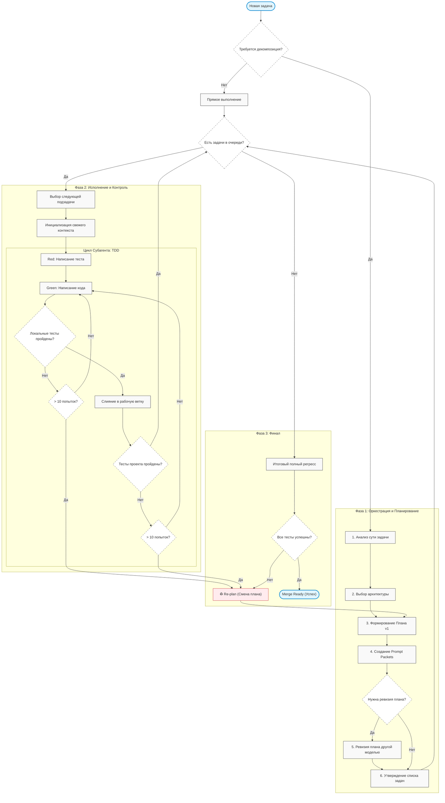

<!--
Name: split-first-tdd-agent-orchestration-framework
Description: Каноническая постановка задачи, принципы, режимы split и split2, план-файл, обработка ошибок и критерии приёмки для split-first оркестрации в Codex, Gemini CLI и Antigravity.
-->

# 🧩 Split-First TDD Agent Orchestration Framework

[](https://opensource.org/licenses/MIT)
[](#)
[](#)

[🇺🇸 English version](README.en.md)

---

Этот репозиторий фиксирует канонические правила для воркфлоу **split-first**: как дробить большие задачи, как отправлять подзадачи подагентам, как делать предварительную ревизию плана и как проверять результат перед слиянием.

### 🌟 Обзор

Это слой координации, а не продуктовая функция и не общий планировщик. Набор правил помогает агенту:

- оценивать, нужно ли дробить большую задачу
- превращать задачу в независимые карточки подзадач
- передавать эти карточки нужному подагенту или CLI-точке входа
- формировать для каждой подзадачи развёрнутый prompt packet
- использовать TDD для подзадач, меняющих код
- проверять итоговый diff перед слиянием

### 📉 Проблема

Большие задачи на код ломаются, когда один агент пытается сделать всё за один проход. Особенно это заметно при:

- маленьких лимитах дорогих моделей
- замусоренном контексте при последовательном исполнении

Типовые сбои: размывание контекста, поверхностное рассуждение, неверные предположения о состоянии репозитория, случайное параллельное редактирование, отсутствие тестов, дублирование работы из-за отсутствия декомпозиции по поведению.

### 🎯 Цели

Главная цель: поднять продуктивность агента внутри отведённого лимита за счёт оркестрационного prompt engineering, снижения когнитивной нагрузки и детального планирования.

Конкретные подцели:

- **Снизить число ошибок** на крупных кодовых задачах — каждая подзадача получает сфокусированный контекст вместо полного хаоса репозитория.
- **Повысить глубину рассуждения** — декомпозиция превращает одну сложную задачу в набор простых, каждая из которых решается в рамках одного TDD-цикла.
- **Разделить чтение и запись** — read-heavy подзадачи (исследование, воспроизведение багов) отделены от write-heavy (правки кода), что устраняет конфликты контекста.
- **Сделать TDD режимом по умолчанию** для implementation-подзадач.
- **Держать каноническую политику в одном месте** и добавить pre-dispatch ревизию плана.

### 🧭 Когда дробить, а когда нет

**Дробить (split), когда:**

- задача затрагивает несколько независимых модулей или поведений
- подзадачи можно валидировать отдельными тестами
- чтение и запись можно развести по разным контекстам

**Не дробить, когда:**

- всё укладывается в один файл и одну функцию
- главная неизвестность — архитектурная, а не операционная (сначала реши, потом делай)
- задача слишком мелкая для оркестрации

**Примеры:**

| Задача                                                                     | Решение      | Почему                                                                       |
| -------------------------------------------------------------------------------- | ------------------- | ---------------------------------------------------------------------------------- |
| «Добавить поле `status` в API endpoint»                         | Не дробить | Один файл, одно поведение, один тест                  |
| «Рефакторинг 5 модулей + новый тест-сьют»       | `/split`          | Независимые модули → параллельные подзадачи |
| «Новый микросервис с неясной архитектурой» | `/split2`         | Сначала ревизия плана, потом исполнение          |

### 💡 Принципы

- Дробить по поведению, а не по числу файлов.
- Предпочитать одного владельца на одну подзадачу.
- Не параллелить пересекающиеся записи.
- Использовать read-heavy подзадачи для исследования и воспроизведения ошибок.
- Использовать write-heavy подзадачи только при раздельной ответственности.
- TDD для всех implementation-задач (red-green-refactor).
- **Нарастающий регресс**: каждая задача дополняет общий набор тестов. Проект всегда должен оставаться «зелёным».
- Факты вместо памяти; проверка от узкой к широкой.

### 🕹 Режимы

- **`/split`**: Прямой dispatch. Процесс: Анализ -> Архитектура -> План v1 -> Тексты задач -> Исполнение.
- **`/split2`**: Ревизия. План и тексты улучшаются другой моделью перед запуском.

**Принцип cross-platform ревизии:** модели одной платформы разделяют общие слепые пятна (предубеждения обучающих данных, стилистические привычки). Ревизия моделью другой платформы выявляет ошибки, которые «свой» ревизор пропустит.

#### Матрица маршрутизации

| Хост             | `/split` executor           | `/split2` reviewer | `/split2` executor          |
| -------------------- | ----------------------------- | -------------------- | ----------------------------- |
| Codex                | Gemini 3 Flash                | Gemini 3.1 Pro high  | Gemini 3 Flash                |
| Gemini / Antigravity | Codex GPT-5.4-mini super high | Codex GPT-5.4 xHigh  | Codex GPT-5.4-mini super high |

> [!NOTE]
> Antigravity — это IDE-агент на базе Gemini, поэтому он использует ту же строку матрицы. Строка для Claude Code будет добавлена позже.

#### Диаграмма workflow



### 📦 Формат prompt packet

Каждая подзадача, отправляемая подагенту, должна содержать полный prompt packet:

| Поле                      | Описание                                                              |
| ----------------------------- | ----------------------------------------------------------------------------- |
| **objective**           | Что конкретно нужно сделать                           |
| **context**             | Бизнес-контекст и архитектурные решения    |
| **scope**               | Файлы и модули, входящие в подзадачу            |
| **non-goals**           | Что явно вне скоупа                                           |
| **files**               | Список файлов для чтения и модификации       |
| **dependencies**        | Зависимости от других подзадач                     |
| **tests**               | Какие тесты написать / какие должны пройти |
| **acceptance_criteria** | Критерии приёмки подзадачи                            |
| **output_format**       | Ожидаемый формат результата                          |
| **stop_conditions**     | Когда остановиться и запросить помощь        |

> [!IMPORTANT]
> Планировщик **обязан** явно передать подагенту: конкретные инструкции + список файлов для чтения. Подагент не должен сам «угадывать» контекст.

Полный шаблон: `references/subtask-prompt-template.md`.

### 🔄 Порядок исполнения и зависимости

1. **Планирование**: Анализ сути запроса и выбор архитектуры до списка задач.
2. **Детализация**: План состоит из детальных текстов (Prompt Packets) для каждой задачи.
3. **Цикл**: Последовательный запуск субагентов.
4. **TDD + Регрессия**: Субагент проходит цикл: Fail -> Код -> Green. Затем вливает тесты в регресс-пакет и добивается прохождения **всех** тестов перед финишем.
5. **Нарастающий итог**: Каждый цикл подтверждает целостность всего проекта.
6. **Граф зависимостей**: Описывается в plan-файле; диспетчер следует этому графу.

### 🧠 Контекстный бюджет

Декомпозиция решает проблему контекста следующим образом:

- **Каждый подагент получает свежий контекст.** Он не наследует «замусоренный» контекст планировщика — только prompt packet с целевыми файлами.
- **Планировщик контролирует объём.** Prompt packet должен помещаться в рабочее окно подагента. Если не помещается — подзадача слишком крупная и требует дальнейшего дробления.
- **Передача состояния.** Промежуточные результаты между подзадачами передаются через файлы в репозитории (коммиты, артефакты), а не через контекст агента.

### 🔁 Обработка ошибок и перепланирование

Фреймворк не ограничивается happy path. Правила для отказов:

- **Подзадача провалена (тесты не проходят):** верификатор фиксирует отказ. Планировщик решает: повторить с уточнённым промптом или переразбить задачу.
- **Контекст одной подзадачи влияет на другую:** read-heavy подзадача обнаружила факт, меняющий план → планировщик обновляет plan-файл и пересоздаёт затронутые карточки до dispatch.
- **Подзадача требует уточнения:** подагент фиксирует stop condition → планировщик получает запрос и уточняет промпт.
- **Весь план оказался неверным:** верификатор после финальной проверки может инициировать полный re-plan.

### 👤 Роль человека

Фреймворк не требует обязательного одобрения на каждом шаге, но обеспечивает **полную прозрачность**:

#### Plan-файл

Создаётся при каждом split/split2 и содержит:

- **Исходный запрос пользователя** — дословно.
- **Переформулированный запрос** — детализированная цель, расписанные подцели.
- **Архитектурные решения** — ключевые решения, принятые до dispatch.
- **Перечень подзадач** — название, атрибуты (тип, владелец, зависимости), ссылка на файл-описание подзадачи для подагента.

#### Файлы подзадач

Каждая подзадача описана в отдельном файле с полным prompt packet, доступном для чтения.

#### Контроль

- Человек может **остановить конвейер** в любой момент.
- Человек может **дождаться завершения** и проанализировать, как конвейер отработал.
- Человек может **принять или отклонить** итоговые изменения.

> [!NOTE]
> Обязательного gate-approval нет. Цель — не блокировать агента, а дать человеку возможность наблюдать и вмешиваться при необходимости.

### 📐 Границы применимости

**Фреймворк подходит для:**

- Кодовых задач с возможностью написания тестов
- Multi-agent окружений (Codex CLI, Gemini CLI, Antigravity)
- Проектов с тестовой инфраструктурой или возможностью её создать

**Фреймворк НЕ подходит для:**

- Однострочных правок, не требующих декомпозиции
- Задач, где невозможен TDD (pure infrastructure без тестов, одноразовые скрипты)
- Проектов без CLI-доступа к агентам

**Необходимые предпосылки:**

- Тестовый фреймворк (или готовность его создать)
- CLI-доступ хотя бы к одному агенту для dispatch подзадач
- Файловая система для хранения plan-файлов и файлов подзадач

### 🚀 Установка

Вы можете установить или обновить правила в своём проекте с помощью скриптов установки. Скрипты инъектируют инструкции воркфлоу в файлы `AGENTS.md`, `CLAUDE.md` и `GEMINI.md`, сохраняя ваши собственные правила. Также доступна [инструкция по ручной установке](MANUAL_INSTALL.md).

#### Windows (PowerShell)

```powershell
Invoke-RestMethod -Uri "https://raw.githubusercontent.com/SpIvanM/split-first-tdd-agent-orchestration-framework/main/install.ps1" | Set-Content -Path install.ps1; powershell -ExecutionPolicy Bypass -File install.ps1; Remove-Item install.ps1
```

#### Linux / macOS (Bash)

```bash
curl -fsSL https://raw.githubusercontent.com/SpIvanM/split-first-tdd-agent-orchestration-framework/main/install.sh | bash
```

#### Удаление

Если вы решите удалить правила оркестрации:

##### Windows (PowerShell)

```powershell
Invoke-RestMethod -Uri "https://raw.githubusercontent.com/SpIvanM/split-first-tdd-agent-orchestration-framework/main/uninstall.ps1" | Set-Content -Path uninstall.ps1; powershell -ExecutionPolicy Bypass -File uninstall.ps1; Remove-Item uninstall.ps1
```

##### Linux / macOS (Bash)

```bash
curl -fsSL https://raw.githubusercontent.com/SpIvanM/split-first-tdd-agent-orchestration-framework/main/uninstall.sh | bash
```

> [!IMPORTANT]
> Скрипты используют маркеры `<!-- ORCHESTRATION_START -->` и `<!-- ORCHESTRATION_END -->`. Содержимое внутри них будет перезаписано при обновлении. Ваши правила добавляйте выше или ниже этих маркеров.

### 🛠 Структура проекта

- `AGENTS.md` — источник истины (канонический контракт).
- `GEMINI.md` и `CLAUDE.md` — адаптеры для конкретных агентов.
- `references/orchestration-matrix.md` — матрица хостов и исполнителей.
- `references/subtask-prompt-template.md` — шаблон prompt packet.
- `references/plan-review-template.md` — шаблон для ревизии плана.
- `agents/skills/task-splitting/SKILL.md` — контракт декомпозиции.

**Роли:**

- **Планировщик** — решает, нужно ли делить; создаёт plan-файл с полным контекстом.
- **Диспетчер** — создаёт файлы подзадач (карточки) с prompt packet и отправляет подагентам.
- **Верификатор** — проверяет результат каждой подзадачи и финальный diff.

### ✅ Критерии приёмки

- Большая задача оценивается на предмет разбиения за один проход.
- Создан plan-файл с запросом, переформулированными целями, архитектурой и перечнем подзадач.
- Разбитая задача даёт независимые карточки с владельцами, файлами и тестами.
- Каждая карточка — отдельный файл с полным prompt packet, включая явный список файлов для чтения.
- Implementation-подзадачи выполняются маленькими TDD-циклами.
- `split2` не запускает подзадачи до завершения ревизии плана.
- Человек может видеть все файлы плана и задач в любой момент.

---

## 📝 License

Distributed under the MIT License. See `LICENSE` for more information.
