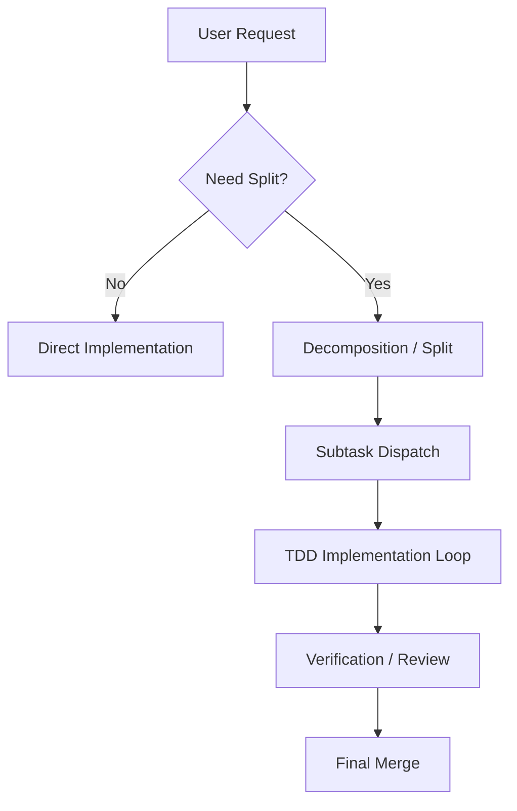

<!--
Name: Пакет оркестрации агентов
Description: Канонический README для split-first воркфлоу. Содержит принципы декомпозиции, инструкции по установке и контракт взаимодействия агентов.
-->

# 🧩 Split-First Agent Orchestration Framework

[](https://opensource.org/licenses/MIT)
[](#)
[](#)

[🇷🇺 Перейти к русской версии](#russian) | [🇺🇸 Switch to English version](#english)

---

## <span id="russian"></span>🇷🇺 Русский

Этот репозиторий фиксирует канонические правила для split-first workflow: как дробить большие задачи, как отправлять подзадачи во внешние инструменты, как делать предварительную ревизию плана и как проверять результат перед слиянием.

### 🌟 Обзор
Большие задачи на код ломаются, когда один агент пытается сделать всё за один проход. Этот фреймворк навязывает **split-first** воркфлоу:
- **Разделение контекста**: Удержание фокуса на малых, изолированных задачах.
- **TDD как стандарт**: Обязательные тесты для каждого изменения кода.
- **Мульти-агентность**: Прозрачное делегирование между разными моделями (Gemini, Codex, Claude).

### 🚀 Установка
Инъектируйте правила в свой проект, сохраняя собственные инструкции.

#### Windows (PowerShell)
```powershell
Invoke-RestMethod -Uri "https://raw.githubusercontent.com/SpIvanM/split-first-tdd-agent-orchestration-framework/main/install.ps1" | Set-Content -Path install.ps1; powershell -ExecutionPolicy Bypass -File install.ps1; Remove-Item install.ps1
```

#### Linux / macOS (Bash)
```bash
curl -fsSL https://raw.githubusercontent.com/SpIvanM/split-first-tdd-agent-orchestration-framework/main/install.sh | bash
```

> [!IMPORTANT]
> Правила обернуты в маркеры `<!-- ORCHESTRATION_START -->`. Повторный запуск скриптов обновит только содержимое внутри этих маркеров.

### 🛠 Процесс


### 🕹 Режимы
- **`/split`**: Прямое разбиение и запуск надежных планов.
- **`/split2`**: Ревизия плана внешней моделью перед запуском для сложных задач.

### 📁 Структура проекта
- `AGENTS.md`: Канонический контракт (Источник истины).
- `GEMINI.md` / `CLAUDE.md`: Адаптеры под конкретные инструменты.
- `references/`: Шаблоны промптов и ревизий.
- `.claude/` / `.gemini/`: Роли агентов и команды.

---

## <span id="english"></span>🇺🇸 English

This repository defines canonical rules for the split-first workflow: how to decompose large tasks, dispatch them to external tools, perform pre-flight plan reviews, and verify results before merging.

### 🌟 Overview
Large coding tasks break when a single agent attempts to do everything in one pass. This framework enforces a **split-first** workflow:
- **Context Hygiene**: Keeps focus sharp on small, isolated tasks.
- **TDD First**: Mandatory tests for every implementation code change.
- **Multi-Agent**: Seamless dispatch between different LLMs and CLI tools (Gemini, Codex, Claude).

### 🚀 Installation
Inject orchestration rules into your project while preserving your custom instructions.

#### Windows (PowerShell)
```powershell
Invoke-RestMethod -Uri "https://raw.githubusercontent.com/SpIvanM/split-first-tdd-agent-orchestration-framework/main/install.ps1" | Set-Content -Path install.ps1; powershell -ExecutionPolicy Bypass -File install.ps1; Remove-Item install.ps1
```

#### Linux / macOS (Bash)
```bash
curl -fsSL https://raw.githubusercontent.com/SpIvanM/split-first-tdd-agent-orchestration-framework/main/install.sh | bash
```

> [!IMPORTANT]
> Rules are wrapped in `<!-- ORCHESTRATION_START -->` markers. Re-running installation will only update the marked content.

### 🛠 Workflow


### 🕹 Modes
- **`/split`**: Direct decomposition and dispatch for reliable plans.
- **`/split2`**: Pre-dispatch plan review by an external model for complex tasks.

### 📁 Project Structure
- `AGENTS.md`: Canonical contract (Source of Truth).
- `GEMINI.md` / `CLAUDE.md`: Platform-specific adapters.
- `references/`: Templates for prompt packets and reviews.
- `.claude/` / `.gemini/`: Agent roles and slash-commands.

---

## 📝 License
Distributed under the MIT License. See `LICENSE` for more information.